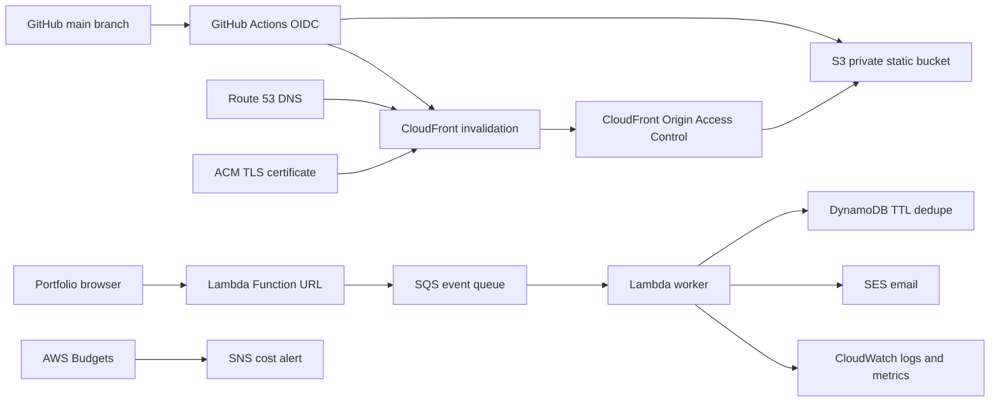

# Cloud Portfolio Platform

This portfolio is designed to run on both Vercel and AWS from the same GitHub repository. Vercel can stay as the current production path while AWS demonstrates a cost-aware serverless deployment and visitor-notification pipeline.

## Goals

- Serve the same static portfolio from AWS with HTTPS and a custom domain.
- Keep Vercel and AWS in sync from the same `main` branch.
- Track only meaningful recruiter actions, not noisy refreshes.
- Send email notifications through AWS without creating always-on infrastructure.
- Show AWS breadth with a clear reason for every service used.

## Target Architecture



## AWS Services Used

- `S3`: private bucket for static files.
- `CloudFront`: CDN, HTTPS, caching, and global delivery.
- `Route 53`: DNS for the AWS-hosted portfolio URL.
- `ACM`: free public TLS certificate for CloudFront.
- `IAM OIDC`: GitHub Actions deploys without long-lived AWS access keys.
- `Lambda Function URL`: lightweight HTTPS endpoint for portfolio events.
- `SQS`: buffers visitor events so email sending is reliable and decoupled.
- `SES`: sends notification email for meaningful interactions.
- `DynamoDB`: deduplicates events and rate-limits notification noise with TTL.
- `CloudWatch`: logs, metrics, alarms, and debugging.
- `AWS Budgets + SNS`: cost guardrails before credits are wasted.

## Visitor Event Strategy

The frontend has an endpoint placeholder in `index.html`:

```html
<meta name="portfolio-event-endpoint" content="" />
```

When the Lambda Function URL is ready, set this value to the endpoint. Until then, the tracker does nothing and causes no network calls.

Tracked events:

- `page_view`
- `resume_open`
- `project_click`
- `email_click`
- `social_click`
- `github_click`
- `hero_action`

Email notifications should be sent only for high-intent events such as resume opens, contact clicks, project clicks, and AI assistant usage. Page views can be stored or summarized daily instead of emailed immediately.

## Cost Controls

- No EC2 instance or always-on server.
- CloudFront caches static assets.
- Lambda runs only on requests.
- SQS smooths bursts and prevents synchronous email failures.
- DynamoDB uses TTL for dedupe records.
- SES sends filtered notifications, not every refresh.
- Bedrock should be added only as a second phase and only on user action.
- AWS Budget alerts should be configured at `$5`, `$10`, and `$20`.

## Deployment Flow

1. Push to `main`.
2. Vercel deploys normally.
3. GitHub Actions deploys the same files to S3 when `AWS_DEPLOY_ENABLED=true`.
4. CloudFront invalidation refreshes cached HTML/CSS/JS.
5. Both Vercel and AWS URLs show the same portfolio.

Detailed self-service setup steps are in [`aws-setup-guide.md`](aws-setup-guide.md).

## GitHub Variables Needed

- `AWS_DEPLOY_ENABLED`: set to `true` when AWS infra is ready.
- `AWS_ROLE_ARN`: IAM role trusted by GitHub OIDC.
- `AWS_REGION`: usually `ap-south-1` for India resources, though CloudFront ACM certificate must be in `us-east-1`.
- `AWS_S3_BUCKET`: private static website bucket name.
- `AWS_CLOUDFRONT_DISTRIBUTION_ID`: CloudFront distribution to invalidate.

## Resume Framing

Cloud Portfolio Platform: Built a dual-deployed portfolio using Vercel and AWS S3/CloudFront with Route 53, ACM, GitHub Actions OIDC, Lambda Function URL, SQS, SES, DynamoDB TTL, CloudWatch, and AWS Budgets. Designed event-driven recruiter notifications with cost controls, private S3 origin access, CDN caching, and no always-on compute.
